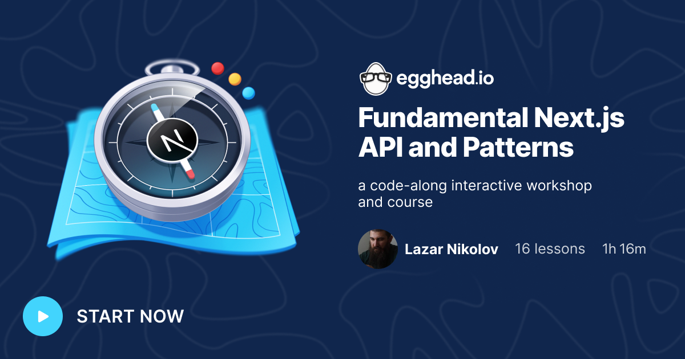

# The Beginner's Guide to Next.js

## 👋 Welcome

Welcome to The Beginner's Guide to Next.js [egghead.io](https://egghead.io) workshop! 🚀

In this workshop we will discover the essential features of Next.js. Every exercise is an isolated mini project that focuses only on a specific feature, so you don't have anything extra to worry about. By the end of this workshop, you'll learn how to create Next.js projects, use Next.js's data fetching methods, create your own API handlers, use UI frameworks, and deploy your apps on Vercel.

I hope you like this workshop, and have fun learning ❤️

## 🤠 Instructor

My name is Lazar Nikolov and I'm a developer / designer from Skopje, North Macedonia 🇲🇰! I work at [Sentry](https://sentry.io) as a Developer Advocate, I'm a core member at [Chakra UI](https://chakra-ui.com), and I'm also an [egghead instructor](https://egghead.io/q/resources-by-lazar-nikolov).

My first interaction with programming was back in 2011, while I was still in high school. I was learning HTML and CSS on my own, sometimes during the classes (don't tell my teachers 🤫). Throughout my career I've been developing mobile apps, TV apps, desktop apps, but I've found my sweet spot as a Full-stack Engineer working with the React ecosystem.

I'm a super friendly guy, so if you have any questions, or just want to talk to me, the best place to reach me is on Twitter at [@NikolovLazar](https://twitter.com/NikolovLazar).

## 🎯 Goal

After finishing this workshop, you'll become comfortable using Next.js to build your web apps and deploy them on Vercel.

## 🚅 Skills

You'll learn about web page rendering like SSR, SSG, which as a skill is completely transferrable in other frameworks and technologies.

If you haven't worked with TypeScript before, that's another skill that you'll learn and also apply in other frameworks and technologies.

We'll also going learn how to architecture our front-end using pages, layouts, and components, which is a skill you can apply in every front-end project in your future.

## 🚧 Prerequisites

Before starting this workshop, you should be comfortable working with React, TypeScript, and understand basic Web Dev concepts.

Here are some egghead.io courses that can bring you up to speed:
- [The Beginner's Guide to React](https://egghead.io/courses/the-beginner-s-guide-to-react) by Kent C. Dodds
- [React Context for State Management](https://egghead.io/courses/react-context-for-state-management) by Dave Ceddia
- [Shareable Custom Hooks in React](https://egghead.io/courses/shareable-custom-hooks-in-react) by Joe Previte
- [Up and Running with TypeScript](https://egghead.io/courses/up-and-running-with-typescript) by John Lindquist
- [Use Types Effectively in TypeScript](https://egghead.io/courses/use-types-effectively-in-typescript) by Ari Picker

## 💽 Workshop Setup

Make sure you have [Node.js](https://nodejs.org/), [Visual Studio Code](https://code.visualstudio.com/) installed on your machine.

Each exercise is its own Next.js project and lives inside the `/exercises` folder. To get started, run `npm install` at the root (this installs all of the dependencies), `cd` into `exercises` and open the execise's README file (`exercises/exercise-01--create-a-new-next-js-type-script-project/README.md`), which contains the instructions. Each exercise can be run by running `npm run dev` at the root of the exercise.

## 🔢 Exercises list

- `Exercise 01` - [Create a new Next.js TypeScript project](exercises/exercise-01--create-a-new-next-js-type-script-project)
- `Exercise 02` - [Create and navigate between pages](exercises/exercise-02--create-and-navigate-between-pages)
- `Exercise 03` - [Create Dynamic Routes](exercises/exercise-03--create-dynamic-routes)
- `Exercise 04` - [Serve static assets](exercises/exercise-04--serve-static-assets)
- `Exercise 05` - [Use `next/image` for Image Optimization](exercises/exercise-05--use-next-image-for-image-optimization)
- `Exercise 06` - [Provide page-specific metadata](exercises/exercise-06--provide-page-specific-metadata)
- `Exercise 07` - [Override the App component](exercises/exercise-07--override-the-app-component)
- `Exercise 08` - [Override the Document](exercises/exercise-08--override-the-document)
- `Exercise 09` - [Create custom style](exercises/exercise-09--create-custom-style)
- `Exercise 10` - [Create custom Layouts](exercises/exercise-10--create-custom-layouts)
- `Exercise 11` - [Use UI frameworks like Chakra UI](exercises/exercise-11--use-ui-frameworks-like-chakra-ui)
- `Exercise 12` - [Use the Static Generation method](exercises/exercise-12--use-the-static-generation-method)
- `Exercise 13` - [Use the Server-side Rendering method](exercises/exercise-13--use-the-server-side-rendering-method)
- `Exercise 14` - [Create and use API Routes](exercises/exercise-14--create-and-use-api-routes)
- `Exercise 15` - [Deploy your Next.js app on Vercel](exercises/exercise-15--deploy-your-next-js-app-on-vercel)

## ❤️ Contributors

PRs are always welcome. If you find a typo, or have any ideas on how to improve the content, feel free to submit a PR. Let's make learning Next.js better for everyone!

## 🍩 Feedback form

Your feedback is always welcome 🙏. It's not just useful for me. Your feedback will help me make the content better for every other developer friend in future. Visit [this form](https://forms.gle/fXJdRAT5SBSjGspb7) if you feel like providing a feedback.

Thank you ❤️
